# Introduction

## Qu'est-ce que le RAG ?
Le RAG (Retrieval-Augmented Generation) est une méthode qui intègre des systèmes de recherche à l'IA générative, permettant aux chatbots d'accéder à des informations récentes et spécifiques provenant de sources externes.

En utilisant un pipeline de recherche, le chatbot peut récupérer des données pertinentes et à jour, puis les combiner avec les capacités linguistiques du modèle génératif afin de produire des réponses à la fois précises et enrichies par le contexte. Cela rend le RAG particulièrement utile pour les applications nécessitant la fourniture de connaissances factuelles en temps réel.

## Aperçu du projet

# Configuration du projet

## Prérequis

Avant de commencer, assurez-vous d'avoir installé la dernière version des éléments répertoriés ici :

* RStudio : l'IDE – RStudio est l'espace de travail principal dans lequel vous écrirez et testerez votre code R. Son interface conviviale, ses outils de débogage et son environnement intégré en font l'outil idéal pour l'analyse de données et le développement de chatbots.

* R : le langage de programmation – R est la colonne vertébrale de votre projet. Vous l'utiliserez pour manipuler les données, appliquer des modèles statistiques et intégrer de manière transparente les composants de votre chatbot de recettes.

* Python – Certaines bibliothèques, comme la bibliothèque d'intégration que vous utiliserez pour la vectorisation de texte, sont construites sur Python. Il est essentiel d'avoir installé Python pour activer ces fonctionnalités parallèlement à votre code R.

* Java – Java sert d'élément fondamental pour certaines bibliothèques d'intégration. Il garantit un traitement efficace et la compatibilité des tâches d'intégration de texte nécessaires à l'entraînement de votre chatbot.

* Docker Desktop – Docker Desktop vous permet d'exécuter ChromaDB, la base de données vectorielle, localement sur votre machine. Cela permet un stockage rapide et fiable des intégrations, garantissant que votre chatbot récupère rapidement les informations pertinentes.

* Ollama – Ollama apporte de puissants modèles linguistiques de grande taille (LLM) directement sur votre ordinateur local, éliminant ainsi le besoin de ressources cloud. Il vous permet d'accéder à plusieurs modèles, de personnaliser les résultats et de les intégrer facilement à votre chatbot.

## Installation d'Ollama

Ollama est un outil open source que vous pouvez utiliser pour exécuter et gérer des LLM sur votre ordinateur. Une fois installé, vous pouvez accéder à divers LLM en fonction de vos besoins. Vous utiliserez le modèle llama3.2:3b-instruct-q4_K_M pour créer ce chatbot.

Un modèle quantifié est une version d'un modèle d'apprentissage automatique qui a été optimisée pour utiliser moins de mémoire et de puissance de calcul en réduisant la précision des nombres qu'il utilise. Cela vous permet d'utiliser un LLM localement, en particulier lorsque vous n'avez pas accès à un GPU (unité de traitement graphique - un processeur spécialisé qui effectue des calculs complexes).

Pour commencer, vous pouvez télécharger et installer le logiciel Ollama ici.

Vous pouvez ensuite confirmer l'installation en exécutant cette commande :

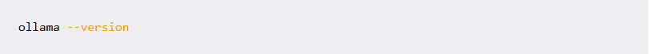

Run the following command to start Ollama:

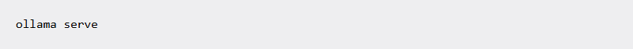

Ensuite, exécutez la commande suivante pour extraire la quantification Q4_K_M de llama3.2:3b-instruct :

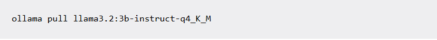

Confirmez ensuite que le modèle a bien été extrait à l'aide de cette commande :

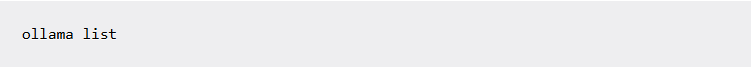

Si l'extraction du modèle a réussi, une liste contenant le nom, l'ID et la taille du modèle sera renvoyée, comme suit :

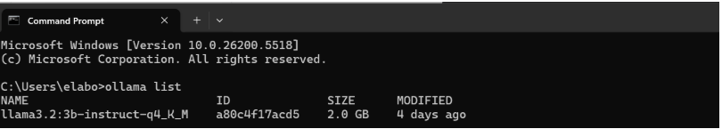

Vous pouvez désormais discuter avec le modèle :

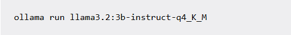

Si l'opération réussit, vous devriez recevoir un message vous invitant à tester le système en posant une question et en obtenant une réponse. Par exemple :

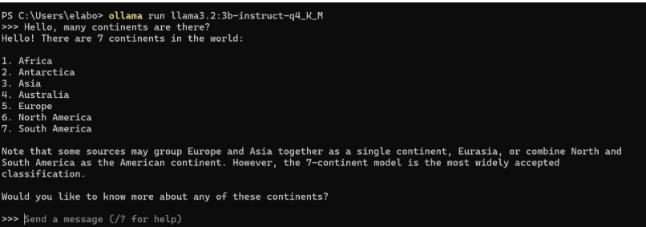

Vous pouvez ensuite quitter la console en tapant /bye ou en appuyant sur Ctrl + D.
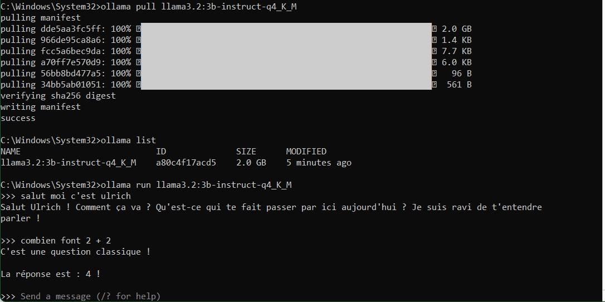

## Collecte et nettoyage des données

Le chatbot que vous développez sera un assistant culinaire qui vous proposera des recettes en fonction des ingrédients dont vous disposez, de ce que vous souhaitez manger et de la quantité de nourriture que permet de préparer une recette.

Vous devez d'abord obtenir les données nécessaires pour entraîner le modèle. Vous utiliserez un ensemble de données contenant des recettes provenant de Kaggle.

Pour commencer, chargez les bibliothèques nécessaires :

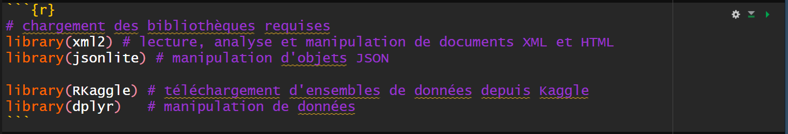

Ensuite, téléchargez et enregistrez l'ensemble de données de recettes :

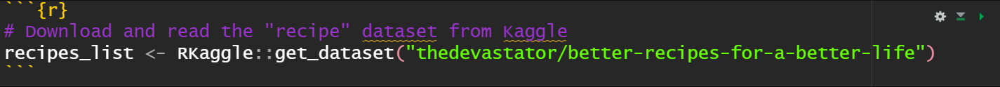

Inspectez le dataframe et extrayez le premier élément comme ceci :

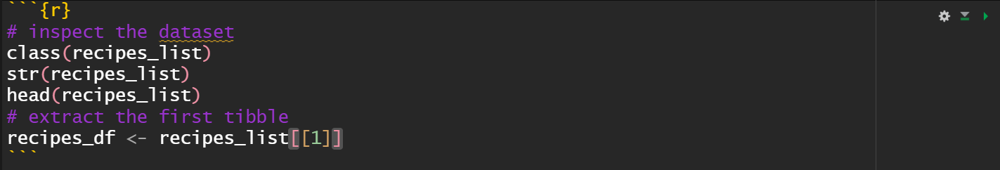

Un rapide examen de l'objet recipes_list montre qu'il contient deux objets de type tibble. Vous n'utiliserez que le premier élément pour ce projet. Un tibble est un type de structure de données utilisé pour stocker et manipuler des données. Il est similaire à un dataframe traditionnel, mais il est conçu pour appliquer des règles plus strictes et effectuer moins d'actions automatiques que les dataframes traditionnels.

Nous utiliserons un dataframe classique dans ce projet, car il est plus familier à la plupart des gens. Il permet également de gérer efficacement l'indexation des lignes, ce qui est essentiel pour accéder à des lignes spécifiques de notre ensemble de données de recettes et les manipuler.

Dans le bloc de code ci-dessous, vous convertirez le tibble en dataframe, puis supprimerez la première colonne, qui est la colonne d'index. Vous inspecterez ensuite le dataframe nouvellement converti et supprimerez les colonnes inutiles.

Il est préférable de supprimer les colonnes inutiles afin de rationaliser l'ensemble de données et de se concentrer sur les caractéristiques pertinentes. Dans ce projet, nous supprimerons certaines colonnes qui ne sont pas particulièrement utiles pour l'entraînement du chatbot. Cela permet de garantir que le modèle se concentre sur des données significatives afin d'améliorer sa précision et sa fonctionnalité.

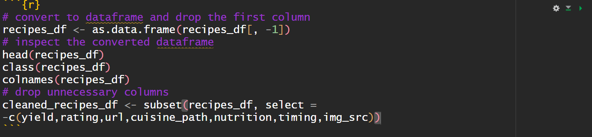

Vous devez maintenant identifier les lignes contenant des valeurs NA (manquantes), ce que vous pouvez faire comme suit :

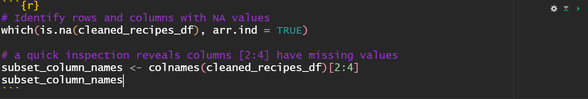

Il est important de traiter les valeurs NA afin de garantir l'exhaustivité de vos données, d'éviter les erreurs et de préserver le contexte.

Remplacez maintenant les valeurs NA et vérifiez qu'il n'y a pas de valeurs manquantes :

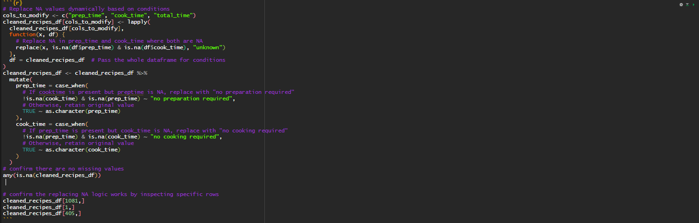

Pour ce tutoriel, nous allons réduire le dataframe aux 250 premières lignes à des fins de démonstration. Cela permet de gagner du temps lors de la génération des embeddings.

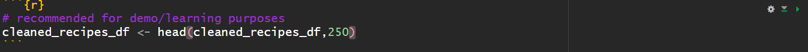

## Comment créer des chunks

Pour comprendre pourquoi le chunking est important avant l'intégration, vous devez comprendre ce qu'est une intégration.

Un encodage est une représentation vectorielle d'un mot ou d'une phrase. Les machines ne comprennent pas le texte humain, elles comprennent les chiffres. Les LLM fonctionnent en transformant le texte humain en représentations numériques afin de fournir des réponses. Le processus de génération d'encodages nécessite beaucoup de calculs, et la décomposition des données à encoder optimise le processus d'encodage.