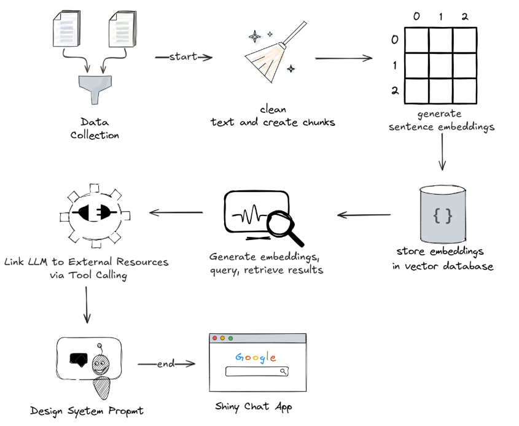

# Introduction

## Qu'est-ce que le RAG ?
Le RAG (Retrieval-Augmented Generation) est une méthode qui intègre des systèmes de recherche à l'IA générative, permettant aux chatbots d'accéder à des informations récentes et spécifiques provenant de sources externes.

En utilisant un pipeline de recherche, le chatbot peut récupérer des données pertinentes et à jour, puis les combiner avec les capacités linguistiques du modèle génératif afin de produire des réponses à la fois précises et enrichies par le contexte. Cela rend le RAG particulièrement utile pour les applications nécessitant la fourniture de connaissances factuelles en temps réel.

## Aperçu du projet
